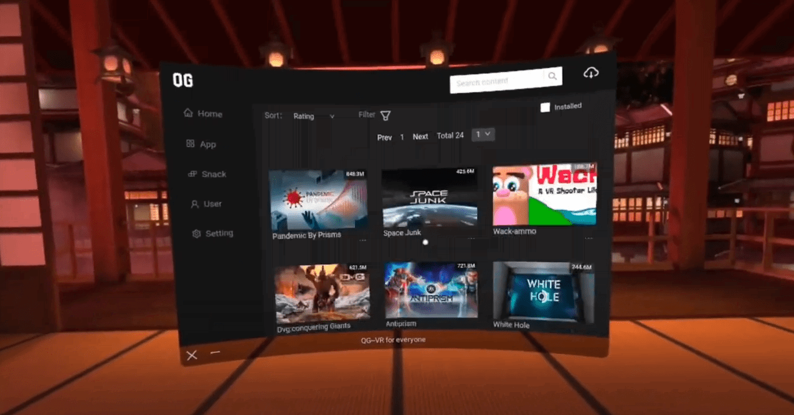

# QuestLauncher
An app launcher with tons of free game resource(1700+) for Quest2

<!-- PROJECT LOGO -->
 

  

  <h3 align="center">QG</h3>

  

    VR for everyone.
     
    <a href="https://www.quest2.games">website</a>
    ·
    <a href="https://github.com/Bumoyu-com/QuestLauncher/issues">bug report</a>
    ·
    <a href="https://discord.gg/qERrQRe5X3">discord</a>
    ·
    <a href="https://www.youtube.com/channel/UChFfrqoA-LPV8UdaoGNqzhQ">youtube</a>
  

<!-- ABOUT THE PROJECT -->
## About The Project

This is a promo repo for QG.

"QG" is a platform of quest2 games and also a quest2 game launcher.
"QG" is the biggest free game collection for you. There are thousands of resource from oculus, sidequest, vrmoo, itch, appLab etc. 
Download, Install and Play freely right in your Quest2. Don't need sideloading or any complex operations.

Link: https://www.quest2.games

(<a href="#top">back to top</a>)

<!-- Installation -->
## Installation

Download QG.zip from release or website. Unzip it, install the apk with adb or using one-click install script.

(<a href="#top">back to top</a>)

<!-- ROADMAP -->
## Roadmap

- [x] Add free&cracked game resource
- [ ] Add 360 video resource
- [ ] Add cloud-based Stream VR games support

See the [open issues](https://github.com/Bumoyu-com/QuestLauncher/issues) for a full list of proposed features (and known issues).

(<a href="#top">back to top</a>)

<!-- CONTACT -->
## Contact

Lennox - [@G1rvan4](https://twitter.com/G1rvan4) - lennox@bumoyu.com

(<a href="#top">back to top</a>)
